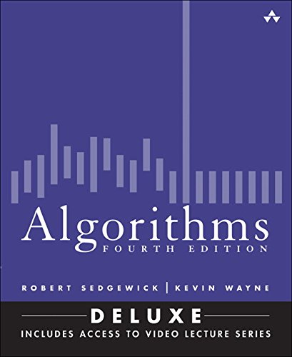

# Algorithms

Solutions to the exercises of the _Algorithms_ (2015) by Robert Sedgewick and Kevin Wayne (Fourth Edition Deluxe).

<a href="https://algs4.cs.princeton.edu/home/"></a>

## Overview

This repository contains a collection of algorithm implementations based on the book "Algorithms" by Robert Sedgewick and Kevin Wayne. The code is written in TypeScript, Java, and Python.

## TypeScript

This repository contains implementations of various algorithms in TypeScript.

### Prerequisites

Ensure you have [Node.js](https://nodejs.org/) installed. Additionally, you'll need TypeScript and `ts-node` installed globally. If you haven't installed them, run:

```bash
npm install -g typescript ts-node
```

### Running the Code

Each algorithm is implemented in its own TypeScript file. To run any of the implementations, use the following command:

```bash
ts-node <filename.ts>
```

Replace `<filename.ts>` with the name of the file you wish to run.

## Java

### Running the Code

To execute a Java implementation, use the following command:

```bash
java-algs4 <file-name>
```

Replace `<file-name>` with the name of the Java file you wish to run.

## Python

### Setup

To set up the Python environment, follow these steps:

1. Read the [Python documentation](https://github.com/pharrukh/lookup_repository/blob/master/python.md#pyenv---python-version-manager).
2. Install PyPy with the following command:
   ```bash
   pyenv install pypy3.10-7.3.12
   ```
3. Create a virtual environment:
   ```bash
   pyenv virtualenv pypy3.10-7.3.12 algorithms
   ```
4. List your virtual environments to verify:
   ```bash
   pyenv virtualenvs
   ```

### Development

To activate the virtual environment, run:

```bash
pyenv activate algorithms
```

To deactivate the virtual environment, run:

```bash
pyenv deactivate
```

### Running the Code

To execute a Python implementation, use the following command:

```bash
python <file-name>
```

Replace `<file-name>` with the name of the Python file you wish to run.

## Acknowledgements

This repository is largely inspired by [algorithms-sedgewick-wayne](https://github.com/reneargento/algorithms-sedgewick-wayne/). Special thanks to [Rene Argento](https://github.com/reneargento) for being a beacon in the goal of solving every problem from Sedgewick and Wayne.

## Contributing

1. Fork the repository.
2. Create your feature branch: `git checkout -b my-new-feature`
3. Commit your changes: `git commit -am 'Add some feature'`
4. Push to the branch: `git push origin my-new-feature`
5. Submit a pull request.

## License

This project is licensed under the MIT License.

## Overview               

See [here](docs/overview.md).